```mermaid
flowchart TB
    HPC[HPC & Edge Fleets] --- NET[Networking L1–L7]
    NET --- SEC[Security & Compliance]
    SEC --- DEV[DevOps & DevSecOps]
    DEV --- CLOUD[Hybrid Cloud & Web Platforms]
    CLOUD --- TAM[Customer Success & TAM Leadership]

    style HPC fill:#76B900,stroke:#333,stroke-width:2px,color:#fff
    style NET fill:#007DB8,stroke:#333,stroke-width:2px,color:#fff
    style SEC fill:#DC2626,stroke:#333,stroke-width:2px,color:#fff
    style DEV fill:#EE0000,stroke:#333,stroke-width:2px,color:#fff
    style CLOUD fill:#0e75b6,stroke:#333,stroke-width:2px,color:#fff
    style TAM fill:#9333EA,stroke:#333,stroke-width:2px,color:#fff
```
  

  
### 👋 Hi, I'm Faradeen!

I’m a **Technical Account Manager & Infrastructure Leader** with deep experience across **full-stack enterprise environments**—from **Layer 1–7 networks and HPC clusters** to **cloud, security, DevOps, and web platforms**.  
My focus is on **driving adoption, ensuring stability, and leading enterprise success** for large-scale fleets and mission-critical workloads.  

I bridge **executive strategy with technical depth**, guiding C-suite leaders, IT teams, and partners to achieve measurable outcomes in performance, security, and revenue growth.  

**Explore my work:**  
<a href="https://faradeen-ja.github.io/TAM-Portfolio/" target="_blank">**My Portfolio Website**</a>
  

---

### 🛠️ Core Stacks & Domains

  
  
  
  
  
  
  
  
  
  
  
  

---

  

  
  

  <h3>🌍 Connect with me</h3>
  

    
    
  

